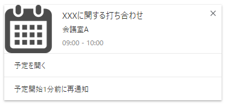
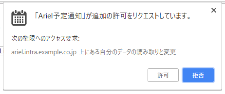

# Arielの予定を通知するChrome拡張

## 機能
* 予定の開始時刻に近くなったらChromeのデスクトップ通知機能で通知する
	
	* 現在の通知時刻は予定開始時刻の5分前（固定）
	* 10分間表示（10分後に自動削除）
* 定期的に予定一覧を取得し通知予約を更新する
	* 現在の更新間隔は1時間（固定）

## 設定
### 初期設定（必須）
* 対象URL
	* 例) http://ariel.intra.example.co.jp/
	* 設定時に対象URLへのアクセスを要求されるので許可してください
		

## よくある質問
* Q. 他人の予定が表示/通知される
	* A. スケジュールアプリの先頭のユーザーを自分にしてください。  
		現在、スケジュールアプリ先頭のユーザーの予定を表示/通知する仕様です。

## TODO
* 通知時刻設定
	* 何分前に通知するか（現在5分固定）
* 通知表示時間設定
	* 何分後に通知を削除するか（現在10分固定）

## アイコン
[アイコン素材ダウンロードサイト「icooon-mono」](http://icooon-mono.com/) の [カレンダーのフリーアイコン2](http://icooon-mono.com/12549-%E3%82%AB%E3%83%AC%E3%83%B3%E3%83%80%E3%83%BC%E3%81%AE%E3%83%95%E3%83%AA%E3%83%BC%E3%82%A2%E3%82%A4%E3%82%B3%E3%83%B32/) を使わせていただきました。
